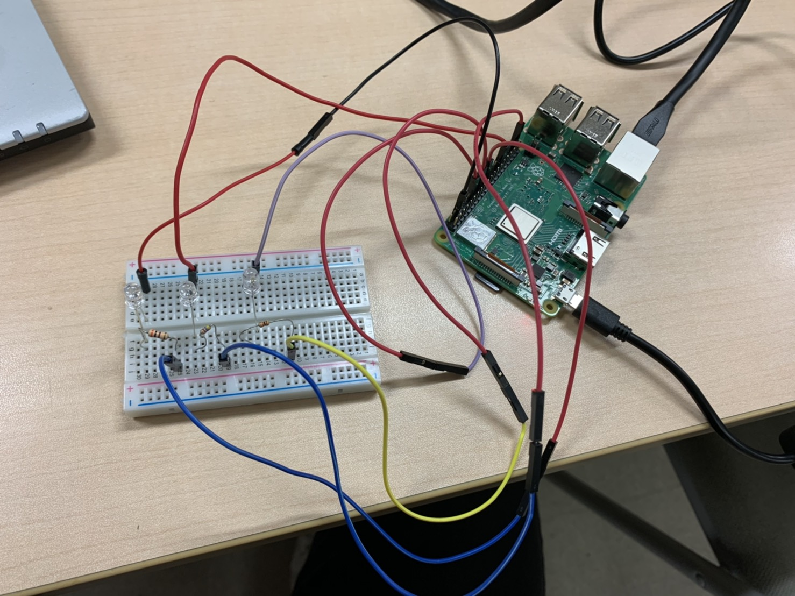

# ロボットシステム学 課題1

ロボットシステム学の授業の第7、8回で作成したデバイスドライバを独自に改良し、githubに置く。

# 2進数をLEDを用いて表現する

LEDを3つ使い光っている状態が1、光っていない状態を0として、001~111まで表現する。

# 動作環境

- OS: Ubuntu 20.04 server
- Raspi: Raspberry Pi 3B+

# 使用道具

- Raspberry pi 3B+/1台
- LED/3個
- ブレッドボード/1枚
- ジャンパー線 オスーメス/6本
- 抵抗/3個

# 回路

以下のように回路を組みました。

3つのLEDのアノードをgpio25、gpio24、gpio23それぞれにジャンパー線を用いて繋げる。また、カソードもそれぞれGNDにつなげる。

# 実行方法

```
$git clone https://github.com/Ryo0927/robosys_device_driver.git  //クローン
$cd robosys_device_driver  //ディレクトリの移動
$make  //カーネルのモジュールの作成
$sudo insmod myled.ko  //カーネルモジュールのインストール
$sudo chmod 666 /dev/myled0  //パーミッションの変更
$echo 0 > /dev/myled0  //000
$echo 1 > /dev/myled0  //100
$echo 2 > /dev/myled0  //010
$echo 3 > /dev/myled0  //110
$echo 4 > /dev/myled0  //001
$echo 5 > /dev/myled0  //101
$echo 6 > /dev/myled0  //011
$echo 7 > /dev/myled0  //111
$echo 0 > /dev/myled0  //000
$sudo rmmod myled  //カーネルモジュールのアンインストール
```
